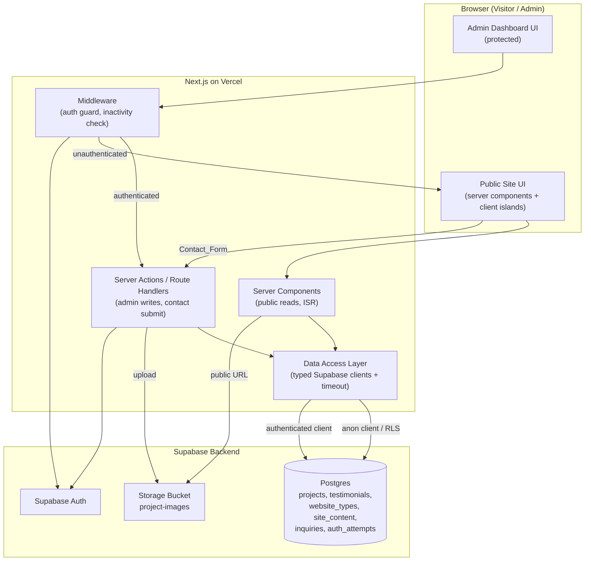
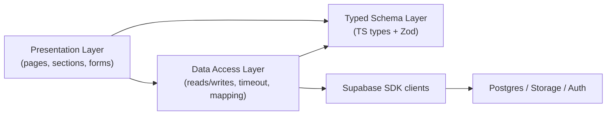
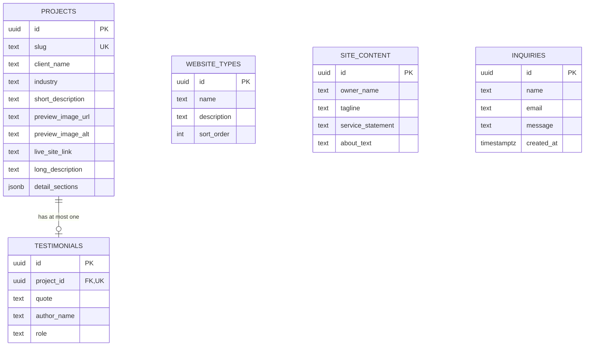

# Design Document

## Overview

The Portfolio_Site is a premium, editorial showcase website built with **Next.js (App Router) + TypeScript**, styled with **Tailwind CSS**, animated with **Framer Motion**, and served images through **next/image**. All content (projects, testimonials, website types, site content, inquiries) lives in **Supabase Postgres**; uploaded imagery lives in **Supabase Storage**; the admin area is protected by **Supabase Auth**. The application is deployed on **Vercel**.

The system is split into two surfaces:

1. **Public site** — server-rendered from Database content, optimized for visual impact and performance. Read-only from the Visitor's perspective except for the Contact_Form, which creates Inquiry records.
2. **Admin dashboard** — authenticated CRUD surface behind Supabase Auth, used by the Owner to manage all content and read inquiries.

A **typed schema layer** (TypeScript types + Zod schemas) mirrors the Database and is the single source of truth for validation on writes and for typed reads, satisfying the "typed schema governs shape, Database holds data" direction from the Introduction and Requirement 1.

Key design goals mapped to requirements:

- Zero hardcoded project content in components; everything is DB-sourced (Req 1.3, 1.4, 2.1).
- Graceful degradation on DB timeout/unreachable, empty states, and image-load failure (Req 2.3, 2.4, 6.4, 7.4, 8.7, 8.8, 11.3).
- Validation enforced both at the application layer (Zod) and Database layer (constraints) (Req 1.5, 1.6, 1.7, 5.6).
- Authentication, lockout, and inactivity expiry for the admin surface (Req 4).
- Premium, accessible, responsive motion within strict timing budgets (Req 16, 17, 18).

### Research Notes and Key Decisions

- **Rendering strategy for public pages.** Next.js App Router server components fetch from Supabase on the server. Public content pages use **ISR (Incremental Static Regeneration)** with a short revalidation window (e.g., `revalidate = 5` seconds) so that a persisted admin change appears on the public site within the 5-second budget of Req 5.4 while still benefiting from cached, fast responses (Req 2.2). On-demand revalidation via `revalidatePath` from admin server actions is used as the primary mechanism, with time-based revalidation as a fallback. This directly serves Req 5.4.
- **Supabase clients.** Two distinct clients are used: an **anon/public server client** (uses the anon key, subject to RLS, for public reads and public inquiry inserts) and an **authenticated server client** (uses the signed-in admin session cookie for admin reads/writes). A service-role client is avoided in request paths to keep RLS as the enforcement boundary; if required for privileged maintenance it is confined to server-only utilities and never shipped to the browser.
- **Timeout handling.** Supabase's `postgrest-js` requests are wrapped with an `AbortController`-based timeout of 10 seconds (Req 2.3). A distinct 3-second soft target guides the ISR/caching approach (Req 2.2) but the hard failure boundary is 10 seconds.
- **URL validation.** A shared Zod refinement uses the WHATWG `URL` constructor to validate `live_site_link`, and the Database adds a `CHECK` constraint (regex on `http(s)://`) as defense in depth (Req 1.7, 5.6).
- **Auth lockout.** Supabase Auth does not natively expose a configurable 5-attempt/15-minute lockout in the client SDK, so lockout is enforced in an application-level table (`auth_attempts`) keyed by account identifier, checked in the sign-in server action (Req 4.5). Inactivity expiry (30 min) is enforced by middleware comparing a `last_active` timestamp stored in the session cookie (Req 4.6).

## Architecture

### High-Level Architecture



### Request Flows

**Public content read (e.g., Selected Work).** Visitor requests a page → Server Component invokes DAL read (anon client, RLS public-read) with a 10s timeout → renders content or empty-state or error-state → `next/image` resolves preview images from Storage public URLs. Cached via ISR (Req 2.2, 2.3, 2.4, 8).

**Contact submission.** Client Contact_Form (client component holding field state) → server action → Zod validation → insert Inquiry row (anon client, RLS insert-only) → returns success/error → UI shows confirmation or retains values (Req 15).

**Admin write.** Admin request passes middleware auth guard → server action validates via Zod → authenticated client writes (RLS authenticated-write) → `revalidatePath` refreshes public pages → success confirmation (Req 5).

**Admin read (inquiries).** Middleware guard → server component reads inquiries via authenticated client (RLS admin-read) ordered by timestamp desc (Req 6.1).

### Layered Structure



## Components and Interfaces

### Directory Structure (illustrative)

```
app/
  (public)/
    layout.tsx                # public shell, nav, motion providers
    page.tsx                  # home: Hero, Selected Work, Website Types, Process, Testimonials, About, Contact
    work/[slug]/page.tsx      # Project_Detail_Page (dynamic, generateStaticParams)
    not-found.tsx             # 404 for unknown project slug
  admin/
    layout.tsx                # protected shell
    sign-in/page.tsx          # sign-in page
    page.tsx                  # dashboard home
    projects/...              # project CRUD
    testimonials/...          # testimonial management
    website-types/...         # website type management
    site-content/...          # site content editor
    inquiries/...             # inquiry list + detail
  actions/                    # server actions (writes, contact submit, auth)
middleware.ts                 # auth guard + inactivity expiry
lib/
  schema/                     # Zod schemas + inferred TS types
  db/                         # data access layer, supabase clients, timeout wrapper
  motion/                     # Framer Motion variants + reduced-motion helpers
components/
  public/                     # Hero, WorkGrid, ProjectCard, Filter, Process, ...
  admin/                      # forms, tables, upload widget
```

### Server vs Client Components

| Component | Type | Rationale |
|-----------|------|-----------|
| Home page shell, section wrappers | Server | Data fetched on server from DB (Req 2, 7, 11, 12, 14) |
| Hero_Section content | Server | Static content read from DB (Req 7) |
| Selected_Work grid data source | Server | Projects read from DB (Req 8) |
| Portfolio_Filter + filtered grid | Client | Interactive single-select filtering without refetch (Req 10) |
| ProjectCard image + hover | Client (island) | Hover transition + image error fallback (Req 8.5, 8.8) |
| Project_Detail_Page | Server | Read by slug, 404 on miss (Req 9) |
| Contact_Form | Client | Holds field state, retains values on error (Req 15.5–15.7) |
| Motion wrappers (entrance) | Client | Uses IntersectionObserver via Framer Motion (Req 17.1) |
| Admin forms, tables, upload | Client | Interactive editing, file selection (Req 3, 5, 6) |
| Admin data fetch (lists) | Server | Reads via authenticated client (Req 6) |

### Public Section Components

- **Hero_Section (server):** Renders `owner_name`, `tagline`, `service_statement` from `site_content`, applying configured placeholders when a field is missing/empty (Req 7.1, 7.3, 7.4, 7.5). CTA control is a client anchor that scrolls to `#contact` (Req 7.2).
- **Selected_Work_Section (server + client island):** Fetches all projects; renders each via `ProjectCard`. The preview image occupies the visually dominant area (grid cell where image spans the full card width and a large aspect ratio, e.g., `aspect-[16/10]`, while text sits in a compact footer) satisfying Req 8.2. Uses `next/image` with `sizes` for responsive delivery (Req 8.6). Empty-state message when zero projects (Req 8.7). Card `Live_Site_Link` opens in new tab via `target="_blank" rel="noopener noreferrer"` (Req 8.3); clicking the card body navigates to the detail page (Req 8.4).
- **ProjectCard (client island):** Manages hover transition (150–400ms, Req 8.5) and image `onError` fallback to a bundled placeholder while retaining text (Req 8.8). Alt text sourced from DB (`preview_image_alt`, Req 18.1).
- **Portfolio_Filter (client):** Derives unique industries from the passed-in project list plus "All", defaults to "All" (Req 10.1, 10.2), single-select (Req 10.5). Filtering is done in-memory on the client from the server-provided full list, so no refetch is needed (Req 10.3, 10.4).
- **Project_Detail_Page (server, dynamic route `work/[slug]`):** `generateStaticParams` enumerates project slugs so one page exists per project (Req 9.1). Displays long description when present else short description (Req 9.2), testimonial quote + author when associated (Req 9.3, 13.2), back-to-work navigation (Req 9.5). Unknown slug triggers `notFound()` → 404 page (Req 9.4).
- **Website_Types_Section (server):** Renders name + description per entry; renders nothing (no entries) without error when empty (Req 11).
- **Process_Section (server):** Renders exactly four fixed stages in order Strategy → Design → Development → Launch, pulling each description from `site_content` (Req 12).
- **Testimonials:** Rendered inline on detail pages and optionally aggregated; each testimonial displays with associated project's client name (Req 13.2), omitted when absent (Req 13.3).
- **About_Section (server):** Renders `about_text` from DB, using placeholder when only placeholder is present (Req 14).
- **Contact_Section (server shell) + Contact_Form (client):** Final CTA statement (Req 15.1) and form (Req 15.2).

### Admin Components

- **Sign-in page (client form + server action):** Email/password → sign-in action. Shows auth error on invalid credentials (Req 4.4), lockout message after 5 failures (Req 4.5).
- **Dashboard shell (server, protected):** Navigation to Projects, Testimonials, Website Types, Site Content, Inquiries.
- **Project CRUD:** List/table + create/edit form + delete with explicit confirmation dialog (Req 5.1, 5.7). Form uses the shared Zod schema; on invalid input, retains entered values and shows per-field messages (Req 5.6).
- **Image upload widget (client):** Validates format (JPEG/PNG/WebP) and size (≤5MB) client-side, uploads to Storage, stores returned public URL on the project record (Req 3). On non-validation failure, shows error and leaves record unchanged (Req 3.5).
- **Testimonials / Website Types / Site Content managers:** CRUD forms bound to their schemas (Req 5.2).
- **Inquiry list + detail (server):** List ordered most-recent-first (Req 6.1), detail view (Req 6.2), empty-state (Req 6.3), error-state on DB unreachable (Req 6.4).

### Data Access Layer (DAL) Interface

The DAL exposes typed, intention-revealing functions and owns timeout + error mapping. Illustrative signatures (not full implementation):

```ts
// lib/db/read.ts  (public, anon client, RLS public-read)
getSiteContent(): Promise<Result<SiteContent, DbError>>
getProjects(): Promise<Result<Project[], DbError>>
getProjectBySlug(slug: string): Promise<Result<Project | null, DbError>>
getWebsiteTypes(): Promise<Result<WebsiteType[], DbError>>
getTestimonialForProject(projectId: string): Promise<Result<Testimonial | null, DbError>>

// lib/db/write.ts  (admin, authenticated client, RLS authenticated-write)
createProject(input: ProjectInput): Promise<Result<Project, ValidationError | DbError>>
updateProject(id: string, input: ProjectInput): Promise<Result<Project, ValidationError | DbError>>
deleteProject(id: string): Promise<Result<void, DbError>>
// ...analogous for testimonials, website_types, site_content

// lib/db/inquiries.ts
createInquiry(input: InquiryInput): Promise<Result<Inquiry, ValidationError | DbError>>  // public insert
listInquiries(): Promise<Result<Inquiry[], DbError>>                                     // admin read
```

- `Result<T, E>` is a discriminated union (`{ ok: true; value: T } | { ok: false; error: E }`) so callers must handle failure explicitly — no unhandled exceptions bubble to the UI (Req 2.3, 6.4, 15.7).
- `DbError` distinguishes `timeout`, `unreachable`, and `unknown` so sections can render the correct error state.
- Every read/write is wrapped by `withTimeout(promise, 10_000)` using `AbortController` (Req 2.3).

## Data Models

### Typed Schema Layer

Zod schemas are the source of truth; TypeScript types are inferred via `z.infer`. The same schemas validate admin writes and public contact submissions, and shape typed reads.

```ts
// lib/schema/project.ts
export const TestimonialEmbed = z.object({
  quote: z.string().min(1).max(1000),
  authorName: z.string().min(1).max(100),
  role: z.string().min(1).max(120).optional(),
});

export const ProjectInput = z.object({
  slug: z.string().min(1).max(60)
        .regex(/^[a-z0-9-]+$/, "lowercase letters, numbers, hyphens only"),
  clientName: z.string().min(1).max(100),
  industry: z.string().min(1).max(60),
  shortDescription: z.string().min(1).max(200),
  previewImageUrl: z.string().min(1),
  previewImageAlt: z.string().min(1).max(300),
  liveSiteLink: z.string().min(1).refine(isValidHttpUrl, "must be a valid URL"),
  longDescription: z.string().min(1).max(2000).optional(),
  detailSections: z.array(ContentBlock).optional(),
});
export type ProjectInput = z.infer<typeof ProjectInput>;
```

`isValidHttpUrl` uses the WHATWG `URL` constructor and requires an `http`/`https` protocol (Req 1.7). The email schema for the Contact_Form enforces the exact rule from Req 15.6 (one `@`, at least one char before, at least one dot-separated domain after).

### Database Schema (Supabase Postgres)

All tables use `uuid` primary keys (`id`) with `created_at`/`updated_at` timestamps unless noted.

**`projects`**

| Column | Type | Constraints | Requirement |
|--------|------|-------------|-------------|
| id | uuid | PK, default `gen_random_uuid()` | — |
| slug | text | NOT NULL, UNIQUE, `CHECK (char_length(slug) BETWEEN 1 AND 60)` | 1.1, 1.6 |
| client_name | text | NOT NULL, `CHECK (char_length BETWEEN 1 AND 100)` | 1.1 |
| industry | text | NOT NULL, `CHECK (char_length BETWEEN 1 AND 60)` | 1.1 |
| short_description | text | NOT NULL, `CHECK (char_length BETWEEN 1 AND 200)` | 1.1 |
| preview_image_url | text | NOT NULL, `CHECK (char_length >= 1)` | 1.1 |
| preview_image_alt | text | NOT NULL, `CHECK (char_length BETWEEN 1 AND 300)` | 18.1 |
| live_site_link | text | NOT NULL, `CHECK (live_site_link ~* '^https?://')` | 1.1, 1.7 |
| long_description | text | NULL, `CHECK (long_description IS NULL OR char_length BETWEEN 1 AND 2000)` | 1.2 |
| detail_sections | jsonb | NULL | 1.2 |
| created_at | timestamptz | NOT NULL, default `now()` | — |
| updated_at | timestamptz | NOT NULL, default `now()` | — |

**`testimonials`** (one-to-one/at-most-one per project via `project_id` UNIQUE)

| Column | Type | Constraints | Requirement |
|--------|------|-------------|-------------|
| id | uuid | PK | — |
| project_id | uuid | NOT NULL, UNIQUE, FK → `projects(id)` ON DELETE CASCADE | 13.1 |
| quote | text | NOT NULL, `CHECK (char_length >= 1)` | 13.1 |
| author_name | text | NOT NULL, `CHECK (char_length >= 1)` | 13.1 |
| role | text | NULL | 1.2 |
| created_at / updated_at | timestamptz | NOT NULL default `now()` | — |

The FK enforces "reference to an existing Project" (Req 13.1); `UNIQUE(project_id)` enforces at-most-one testimonial per project; `ON DELETE CASCADE` keeps referential integrity when a project is deleted.

**`website_types`**

| Column | Type | Constraints | Requirement |
|--------|------|-------------|-------------|
| id | uuid | PK | — |
| name | text | NOT NULL, `CHECK (char_length >= 1)` | 11.1 |
| description | text | NOT NULL, `CHECK (char_length >= 1)` | 11.1 |
| sort_order | int | NOT NULL default 0 | — |
| created_at / updated_at | timestamptz | NOT NULL default `now()` | — |

**`site_content`** (single-row / key-value hybrid; modeled as a single row of typed columns)

| Column | Type | Constraints | Requirement |
|--------|------|-------------|-------------|
| id | uuid | PK (singleton row enforced by `CHECK` on a fixed key or a partial unique index) | — |
| owner_name | text | NULL (placeholder applied at render) | 7.1, 7.3, 7.4 |
| tagline | text | NULL | 7.1 |
| service_statement | text | NULL | 7.1 |
| about_text | text | NULL | 14.1 |
| process_strategy | text | NOT NULL default '' | 12.2, 12.3 |
| process_design | text | NOT NULL default '' | 12.2, 12.3 |
| process_development | text | NOT NULL default '' | 12.2, 12.3 |
| process_launch | text | NOT NULL default '' | 12.2, 12.3 |
| contact_email | text | NULL | 7.5 |
| updated_at | timestamptz | NOT NULL default `now()` | — |

Nullable content fields let the render layer substitute configured placeholders (Req 7.4, 7.5, 14.3) rather than rejecting the row.

**`inquiries`**

| Column | Type | Constraints | Requirement |
|--------|------|-------------|-------------|
| id | uuid | PK | — |
| name | text | NOT NULL, `CHECK (char_length BETWEEN 1 AND 100)` | 15.2, 15.3 |
| email | text | NOT NULL, `CHECK (char_length BETWEEN 1 AND 254)` | 15.2, 15.3 |
| message | text | NOT NULL, `CHECK (char_length BETWEEN 1 AND 2000)` | 15.2, 15.3 |
| created_at | timestamptz | NOT NULL, default `now()` | 15.3 |

`created_at` is the persisted timestamp; the inquiry list orders by `created_at DESC` (Req 6.1).

**`auth_attempts`** (application-level lockout support, Req 4.5)

| Column | Type | Constraints |
|--------|------|-------------|
| account_key | text | PK (email, lowercased) |
| failed_count | int | NOT NULL default 0 |
| locked_until | timestamptz | NULL |
| last_failed_at | timestamptz | NULL |

### Entity Relationships



### Supabase Storage and RLS

- **Storage bucket `project-images`:** public-read bucket. Objects are keyed by project slug + uuid to avoid collisions. Accepts JPEG/PNG/WebP up to 5MB, enforced client-side before upload and re-checked in the upload server action (Req 3.3, 3.4). The returned public URL is written to `projects.preview_image_url` only after a successful upload (Req 3.2, 3.5).
- **RLS policies:**
  - `projects`, `testimonials`, `website_types`, `site_content`: **public SELECT** (anon role) — supports public reads (Req 2.1, 2.2). **INSERT/UPDATE/DELETE restricted to authenticated role** (Req 5, admin-only writes).
  - `inquiries`: **public INSERT only** (anon can insert, cannot select) — supports Contact_Form submission (Req 15.3) without exposing inquiries publicly. **SELECT restricted to authenticated role** — admin-only reads (Req 6).
  - `auth_attempts`: no anon access; managed by the sign-in server action.
  - Storage bucket: public read; write policy restricted to authenticated role.

## Correctness Properties

*A property is a characteristic or behavior that should hold true across all valid executions of a system-essentially, a formal statement about what the system should do. Properties serve as the bridge between human-readable specifications and machine-verifiable correctness guarantees.*

These properties target the pure-logic layers of the system (schema validation, URL/email validation, placeholder substitution, filter logic, content selection, motion-config budgets, and the graceful-error contract of the DAL). Infrastructure, layout, and animation-runtime concerns are covered by the unit/integration/component tests described in the Testing Strategy rather than by properties.

### Property 1: Required-field validation rejects and identifies the offending field

*For any* candidate project record that omits at least one required field or supplies a value whose type or length falls outside the declared bounds, the schema validation SHALL reject the record and the resulting error SHALL identify each offending field.

**Validates: Requirements 1.1, 1.5, 5.6**

### Property 2: Optional fields validate when present and are omittable when absent

*For any* project record, validation SHALL succeed regardless of which optional fields are present or absent, and SHALL enforce the declared bounds on any optional field that is present.

**Validates: Requirements 1.2**

### Property 3: Slug uniqueness is enforced

*For any* set of project records, if two or more records declare the same slug (unique identifier), the system SHALL reject all but the first and report the duplicated identifier.

**Validates: Requirements 1.6**

### Property 4: Live-site-link URL validation

*For any* string, the live-site-link validator SHALL accept it if and only if it is a well-formed absolute `http` or `https` URL, and SHALL reject it with a validation error otherwise.

**Validates: Requirements 1.7, 5.6**

### Property 5: Optional-field omission never causes a runtime error

*For any* project with an arbitrary subset of its optional fields omitted, rendering that project SHALL complete without throwing and SHALL omit the UI element corresponding to each absent optional field.

**Validates: Requirements 1.8**

### Property 6: Data-access failures produce a typed error, never an unhandled exception

*For any* data-access operation whose underlying client rejects, aborts, or exceeds the 10-second timeout, the data access layer SHALL return a failure `Result` (never throw), and the consuming section SHALL render its error state without terminating.

**Validates: Requirements 2.3, 6.4, 15.7**

### Property 7: Empty result sets yield an empty state without error

*For any* content section, when the Database returns zero records for that section, the section SHALL render its empty state without displaying an error and without throwing.

**Validates: Requirements 2.4, 6.3, 8.7, 11.3**

### Property 8: Upload validation accepts only allowed type and size

*For any* candidate upload characterized by a MIME type and byte size, the upload validator SHALL accept it if and only if the type is one of JPEG, PNG, or WebP and the size is at most 5 megabytes, and SHALL otherwise reject it with a validation error naming the accepted formats and maximum size.

**Validates: Requirements 3.3, 3.4**

### Property 9: Failed upload leaves the project record unchanged

*For any* upload that fails for a non-validation reason, the associated project record SHALL remain unchanged (no preview-image URL created or updated) and an error SHALL be surfaced.

**Validates: Requirements 3.5**

### Property 10: Unauthenticated requests never receive admin content

*For any* admin route path, a request without a valid authenticated session SHALL be redirected to the sign-in page and SHALL NOT receive any admin dashboard content.

**Validates: Requirements 4.1, 4.2**

### Property 11: Sign-in lockout after five consecutive failures

*For any* sequence of sign-in attempts for a single account, once five consecutive invalid-credential attempts have occurred, every subsequent attempt within the following 15 minutes SHALL be blocked with a lockout message.

**Validates: Requirements 4.5**

### Property 12: Session validity is exactly the inactivity window

*For any* pair of `(last_active, now)` timestamps, a session SHALL be considered valid if and only if `now - last_active` is less than 30 minutes; an explicit sign-out SHALL always render the session invalid.

**Validates: Requirements 4.6**

### Property 13: Inquiry list ordering is most-recent-first

*For any* set of inquiry records, the rendered inquiry list SHALL be ordered strictly by `created_at` from most recent to oldest.

**Validates: Requirements 6.1**

### Property 14: Content placeholder substitution

*For any* site-content record and configured placeholder set, the resolved value for each substitutable field (owner name, tagline, service statement, about text) SHALL equal the Database value when that value is present and non-empty, and SHALL equal the configured placeholder when the Database value is missing or empty.

**Validates: Requirements 7.4, 7.5, 14.2, 14.3**

### Property 15: Project card renders all required fields

*For any* project, rendering its Selected Work card SHALL include the client name, industry, short description, preview image, and live-site link.

**Validates: Requirements 8.1**

### Property 16: Image-load failure shows a fallback while retaining details

*For any* project whose preview image fails to load, the card SHALL display the fallback placeholder image while retaining the remaining project details, and SHALL NOT throw.

**Validates: Requirements 8.8**

### Property 17: Exactly one detail page per project

*For any* set of projects, the generated detail-page routes SHALL be in one-to-one correspondence with the project slugs (exactly one route per project, and each route's slug matches a project).

**Validates: Requirements 9.1**

### Property 18: Detail description selection prefers long over short

*For any* project, the description shown on its detail page SHALL be the long description when present and non-empty, and otherwise the short description.

**Validates: Requirements 9.2**

### Property 19: Testimonial is shown exactly when associated

*For any* project, its detail rendering SHALL display the associated testimonial's quote, author name, and the project's client name when a testimonial is associated, and SHALL omit any testimonial without throwing when none is associated.

**Validates: Requirements 9.3, 13.2, 13.3**

### Property 20: Unknown project identifier yields a 404

*For any* slug that does not correspond to a project in the Database, requesting the detail page SHALL result in a 404 not-found response.

**Validates: Requirements 9.4**

### Property 21: Filter options are the unique industries plus "All"

*For any* set of projects, the filter option set SHALL equal the set of distinct industries present in those projects together with a single "All" option, with no duplicate options.

**Validates: Requirements 10.1**

### Property 22: Filtering shows exactly the matching projects

*For any* set of projects and any selected option, the displayed projects SHALL be every project whose industry equals the selection when a specific industry is selected, and SHALL be the complete project set when "All" is selected.

**Validates: Requirements 10.3, 10.4**

### Property 23: At most one filter category is selected

*For any* sequence of filter selections, the number of simultaneously selected categories SHALL always be exactly one (selecting a new category deselects the previous).

**Validates: Requirements 10.5**

### Property 24: Non-empty name and description for website types

*For any* website-type record, validation SHALL reject it if its name or description is empty and SHALL accept it when both are non-empty.

**Validates: Requirements 11.1**

### Property 25: Process stages are the fixed ordered four

*For any* site-content record, the rendered process stages SHALL be exactly four, in the order Strategy, Design, Development, Launch, regardless of the stage descriptions.

**Validates: Requirements 12.1**

### Property 26: Testimonial field validation and referential integrity

*For any* testimonial record, validation SHALL reject it if its quote or author name is empty, and the record SHALL be rejected unless its project reference points to an existing project.

**Validates: Requirements 13.1**

### Property 27: Contact-form field-length validation

*For any* contact submission, validation SHALL accept the name, email, and message if and only if each is within its declared length bounds (name 1-100, email 1-254, message 1-2000), and SHALL reject and identify each field outside its bounds.

**Validates: Requirements 15.2, 15.5**

### Property 28: Empty required contact fields are rejected and identified

*For any* contact submission with one or more empty required fields, validation SHALL reject the submission and identify each empty required field.

**Validates: Requirements 15.5**

### Property 29: Email format validation

*For any* string, the email validator SHALL accept it if and only if it contains exactly one `@`, at least one character before the `@`, and at least one dot-separated domain after the `@`, and SHALL reject it otherwise.

**Validates: Requirements 15.6**

### Property 30: Valid submission persists all fields with a timestamp

*For any* valid contact submission, persisting it SHALL create an inquiry record that retains the submitted name, email, and message and carries a populated `created_at` timestamp.

**Validates: Requirements 15.3**

### Property 31: Micro-interaction and entrance timing budgets

*For any* defined motion transition, its configured duration SHALL be at most 300 milliseconds when the transition is a micro-interaction and at most 600 milliseconds when the transition is an entrance transition.

**Validates: Requirements 17.2, 17.4**

### Property 32: Reduced-motion disables transitions and shows final state

*For any* motion variant, when a reduced-motion preference is active, the resolved transition SHALL be disabled (zero-duration / instant) and the content SHALL be presented in its final rendered state.

**Validates: Requirements 17.3**

### Property 33: Every project preview image has non-empty alt text

*For any* project record, validation SHALL require a non-empty alternative-text value (1-300 characters) for the preview image, and the rendered image SHALL carry that non-empty alt text.

**Validates: Requirements 18.1**

## Error Handling

The system treats failure as a first-class, typed outcome rather than an exception to be caught ad hoc.

### Data Access Errors

- All DAL functions return `Result<T, DbError>`; callers destructure and branch. `DbError` is a discriminated union: `{ kind: 'timeout' }`, `{ kind: 'unreachable' }`, `{ kind: 'unknown'; detail?: string }`.
- Every request is wrapped by `withTimeout(op, 10_000)` backed by an `AbortController`. On timeout the DAL resolves to `{ ok: false, error: { kind: 'timeout' } }` (Req 2.3).
- Section renderers map failure `Result`s to a user-visible error state ("content could not be loaded") without throwing, so the process never terminates and no unhandled exception surfaces (Req 2.3, 6.4). This is guaranteed by Property 6.

### Empty States

- Zero-record reads are a success `Result` with an empty collection, distinct from an error. Each section renders a purpose-specific empty state (Selected Work, Website Types, Inquiries) without an error banner (Req 2.4, 6.3, 8.7, 11.3). Guaranteed by Property 7.

### Validation Errors (Admin + Contact)

- Writes validate through the shared Zod schemas before any DB call. On failure the server action returns a `ValidationError` carrying a per-field message map; the form re-renders with the user's entered values retained and messages shown inline (Req 5.6, 15.5, 15.6). Rejection behavior is guaranteed by Properties 1, 3, 4, 24, 26, 27, 28, 29, 33; value retention is verified by component tests.
- Database `CHECK`/`UNIQUE`/`NOT NULL` constraints provide defense in depth: a constraint violation is mapped to a `ValidationError` (e.g., unique-violation → duplicate-slug message) rather than a raw DB error (Req 1.5, 1.6, 1.7).

### Image Upload Errors

- Client-side pre-check rejects disallowed type/size before upload (Req 3.4); the upload server action re-validates. A non-validation upload failure returns an error and the project record is left untouched — no URL is written (Req 3.5). Guaranteed by Properties 8 and 9.

### Auth Errors

- Invalid credentials return an authentication error (Req 4.4). The lockout gate checks `auth_attempts` before delegating to Supabase Auth; after five consecutive failures it returns a lockout error for 15 minutes (Req 4.5, Property 11). Middleware enforces route protection and inactivity expiry, redirecting unauthenticated or expired sessions to sign-in (Req 4.2, 4.6, Properties 10 and 12).

### Not Found

- `getProjectBySlug` returning `null` triggers `notFound()` in the detail route, rendering the 404 page (Req 9.4, Property 20).

### Contact Persistence Failure

- If the inquiry insert fails, the server action returns an error `Result`; the form shows "your inquiry could not be saved" and retains entered values (Req 15.7, Property 6).

## Testing Strategy

The strategy combines **property-based tests** (universal correctness of pure logic), **unit tests** (specific examples and edge cases), **integration tests** (Supabase, storage, auth, server actions), and **component tests** (rendering, interaction, accessibility). Property tests catch general correctness; unit and integration tests catch concrete wiring and infrastructure behavior.

### Property-Based Testing

- **Library:** `fast-check` (the standard PBT library for the TypeScript/JavaScript ecosystem), integrated with the project's test runner (Vitest or Jest). PBT is not implemented from scratch.
- **Iterations:** each property test runs a minimum of **100 generated cases** (`fc.assert(..., { numRuns: 100 })` or higher).
- **Tagging:** each property test is tagged with a comment in the form
  `// Feature: premium-portfolio-website, Property {number}: {property_text}`
  and each maps to exactly one property from the Correctness Properties section (single property-based test per property).
- **Targets and generators:**
  - Schema/validation properties (1, 2, 3, 4, 8, 24, 26, 27, 28, 29, 33): custom `fc.record` generators produce in-bounds and out-of-bounds project/testimonial/website-type/contact/upload inputs, including boundary lengths, whitespace-only strings, and malformed URLs/emails.
  - Filter/selection/content properties (14, 17, 18, 19, 21, 22, 23, 25): generate arbitrary project sets, site-content records, and selection sequences over pure functions (`resolveContent`, `filterProjects`, `deriveFilterOptions`, `selectDescription`, `buildProcessStages`, `generateStaticParams` mapping).
  - Ordering property (13): generate inquiry lists with random timestamps; assert descending order.
  - Motion-config properties (31, 32): enumerate the exported Framer Motion variant/transition configs and assert duration budgets and reduced-motion resolution.
  - Graceful-error and empty-state properties (6, 7, 5, 16): drive the DAL and section renderers with a **mocked Supabase client** that can reject, abort/timeout, or return empty sets; assert typed `Result`, no throw, and correct error/empty/fallback rendering. Mocks keep these low-cost so 100+ iterations are justified.
  - Access-control and lockout properties (10, 11, 12): run the middleware guard, lockout state machine, and inactivity predicate as pure/mocked units over generated route paths, attempt sequences, and timestamp pairs.
  - Not-found and one-page-per-project properties (17, 20): generate project sets and slug inputs against the route resolution logic with a mocked read layer.

### Unit Tests (examples and edge cases)

- Placeholder rendering with a mix of null/empty/non-empty content fields (Req 7.1, 7.3, 14.1).
- Description selection edge cases (empty long description falls back to short) (Req 9.2).
- Boundary lengths for each field (exactly min and max) (Req 1.1, 15.2).
- Email edge cases (multiple `@`, leading dot, missing domain) (Req 15.6).

### Integration Tests

- Supabase reads/writes against a test project (or local Supabase) for create/edit/delete of each content type and confirmation of persistence (Req 5.1, 5.2, 5.3).
- Storage upload happy path: upload a valid image, assert public URL stored on the project (Req 3.1, 3.2).
- Auth happy path: valid sign-in establishes a session; sign-out ends it (Req 4.3, 4.6).
- Revalidation: after an admin write, assert `revalidatePath` triggers a fresh public read so the change appears within budget (Req 5.4).
- RLS policy checks: anon can select public content and insert inquiries but cannot select inquiries; authenticated role can write and read inquiries (Req 6, 15.3).
- Page-load timing under normal conditions for a representative page (Req 2.2).

### Component Tests

- Selected Work card: dominant-image layout class present, `next/image` used with `sizes`, hover transition duration within 150-400ms, live link opens in new tab (Req 8.2, 8.5, 8.6, 8.3).
- Contact form: value retention on validation and persistence errors; success confirmation shown (Req 15.4, 15.5, 15.7).
- Filter: "All" selected by default; single-select interaction (Req 10.2).
- Delete confirmation dialog required before deletion (Req 5.7).
- Responsive layout at 320px / mobile / tablet / desktop widths with no horizontal overflow (Req 16.1-16.4).
- Accessibility: keyboard operability of filter, links, and form fields; visible focus indicators; DOM/tab order matches content order; no positive `tabindex` (Req 18.2, 18.3, 18.4).
- Motion: entrance transition fires at 25% intersection; reduced-motion disables transitions (Req 17.1, 17.3).

Note on accessibility: automated component tests cover keyboard operability, focus visibility, alt-text presence, and tab order, but full WCAG conformance also requires manual testing with assistive technologies and expert accessibility review.
